# Object Detection
### Overview
- Image Data 속의 모든 객체를 인지하는 문제(task)
- Image Data 속의 모든 객체를 Bounding Box로 표시하고 그 객체가 무엇인지 예측하는 방법
- 객체의 Class 인지(Classification) + 객체의 위치 인지(Localization)
- [ex] Class: dog & 위치: (x,y,w,h) - 4개의 position
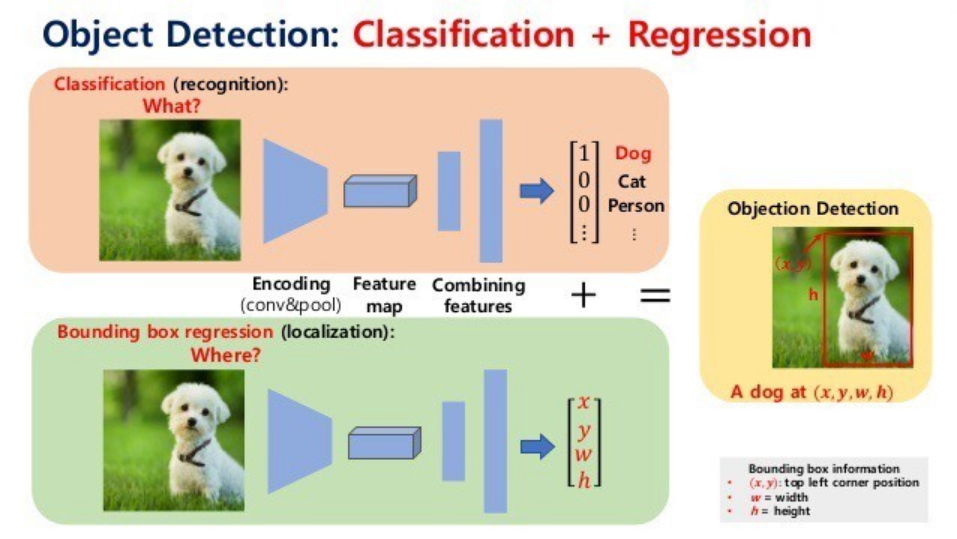

### 학습 방식
- Single object
    - class에 대한 Softmax와 box에 대한 L2의 Multitask Loss
    - 각 Loss의 중요도에 따라 tuning
    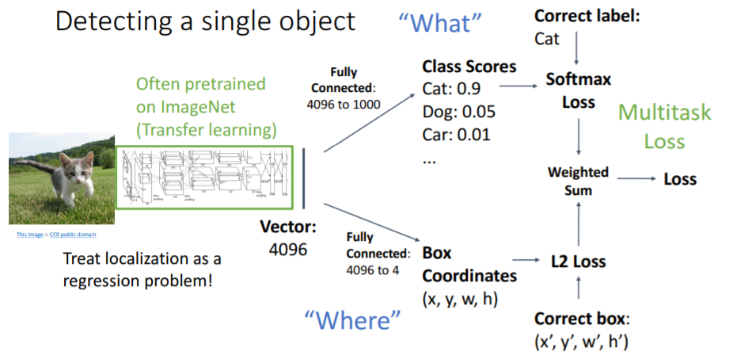
- Multiple Object
    - 기존 학습 방식은 하나의 Image Data에서 여러 객체를 한 객체로 인지하고 학습하려다 보니 문제 발생
    - 해당 문제를 해결하기 위해 Region Proposal 방식 활용
    - Region Proposal
        1. Sliding window
            - Image Data에 임의의 모양의 bounding box를 만들어 이동시키면서 객체 존재 가능성을 판단하는 방법
            - class에 객체 이외 background를 추가하여 객체가 없는 경우 background class로 표현
            - 시간이 오래 걸리고 연산량이 많음
            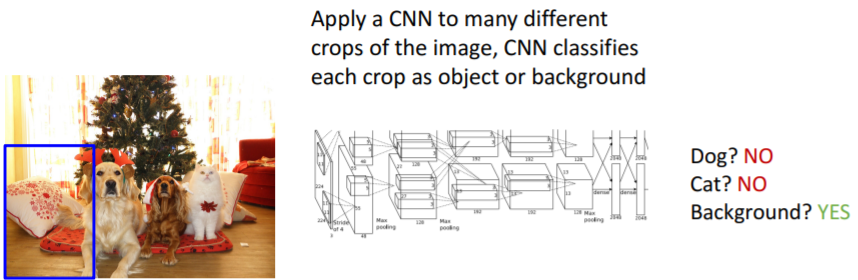
        2. Selective Search
            - Sliding window 한계점을 극복하기 위한 방안
            - Image Data에서 객체가 있을 만한 부분(candidate region)만 bounding box를 여러개 생성하고 최적의 Bounding Box를 선정하는 방식
            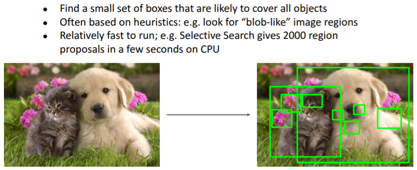

### 주요 Model
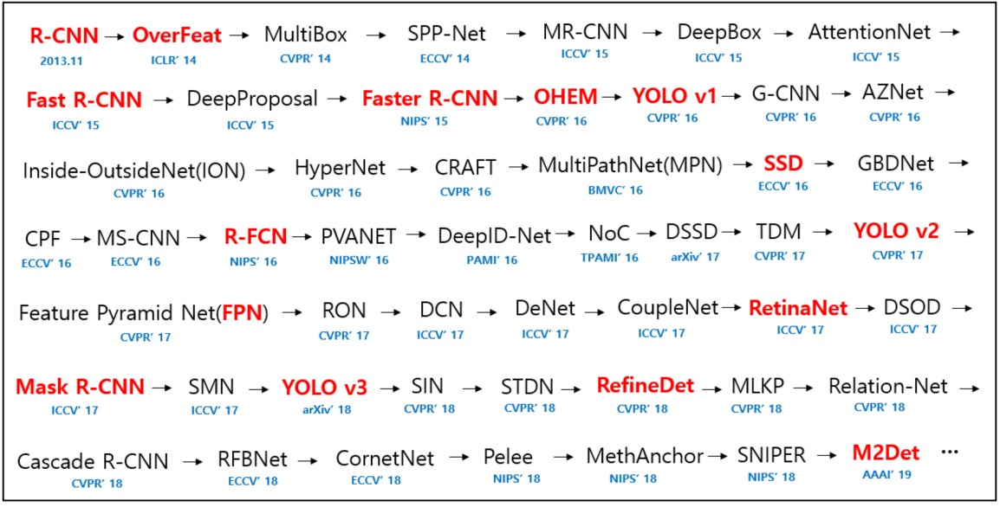
#### R-CNN(Region-Based CNN)
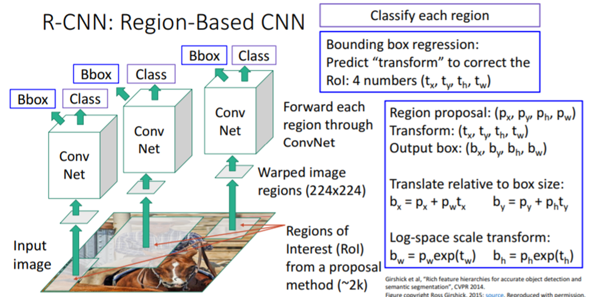
- 학습 과정
    1. Image Data에서 2000개 정도의 영역(RoI)을 추출
    2. 동일한 크기에 대한 classification을 위해 224x224 크기로 warp
    3. Conv net을 통해 class 갯수 + 1(background)에 대한 classification
    4. Bounding box regression을 통해 x,y,h,w 예측
- 하나의 Image Data에서 약 2000개의 RoI에 대하여 독립적으로 inference하기 때문에 속도가 느림

#### Fast R-CNN
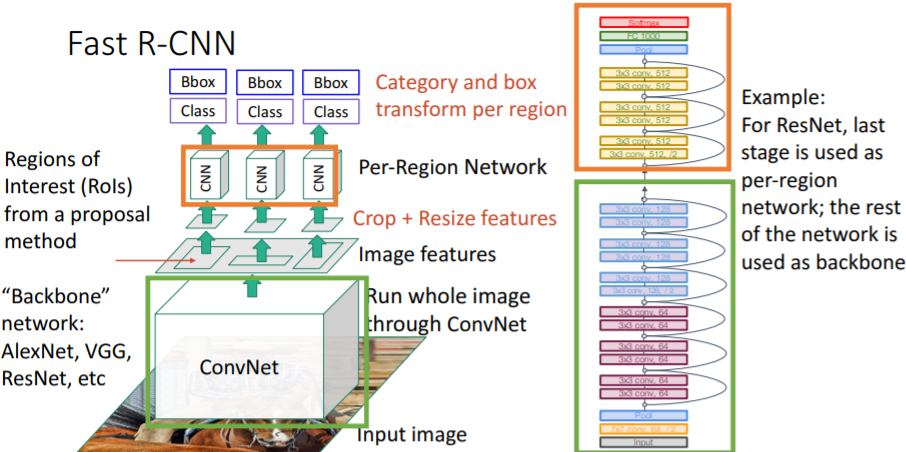
- R-CNN의 속도 개선을 위해 CNN을 통해 Feature를 추출하고, Feature에 대해 Region proposal 하는 방식
- 학습 과정
    1. ConvNet을 통해 Image Data의 Feature map 추출
    2. Feature map에서 RoI 추출
    3. RoI를 crop 및 resize 후 CNN을 통해 class와 bounding box 계산
- R-CNN과 성능 비교
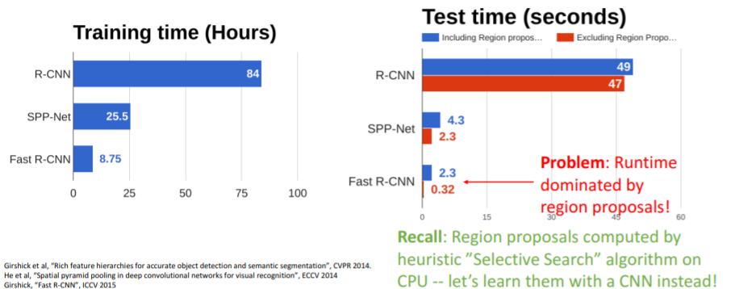

#### Faster R-CNN
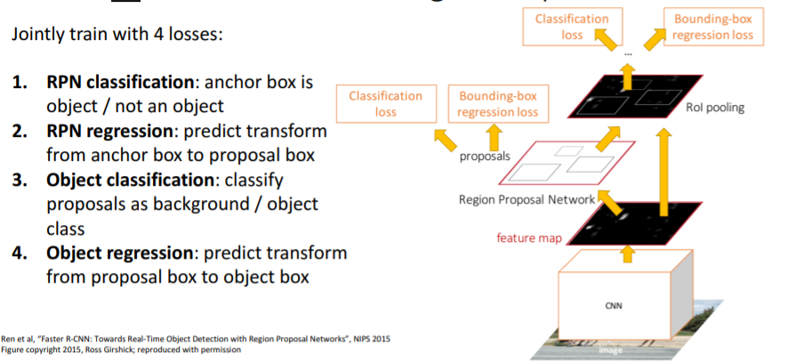
- 속도 개선을 위해 Region Proposal Network(RPN)을 통해 region proposals을 예측하는 과정으로 Selective search 대체
- 학습 과정
    1. ConvNet을 통해 Image Data의 Feature map 추출
    2. Feature map의 각 point에 고정된 사이즈의 anchor box들을 사용
    3. CNN을 통해 각 anchor box의 object 포함 여부 분류
    4. box transforms로 anchor box가 object 위치에 가까워지도록 변환
    5. object를 포함하고 있는 anchor box에 대한 box transform 또한 예측하여 anchor box를 proposal box로 regression
    6. K개의 서로 다른 anchor box들을 각 feature map point에 적용
- Fast R-CNN과 성능 비교
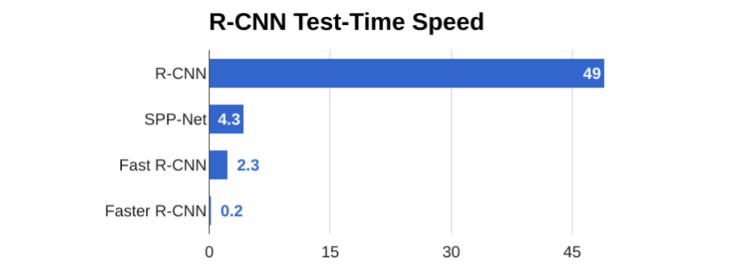

#### YOLO(You Only Look Once)
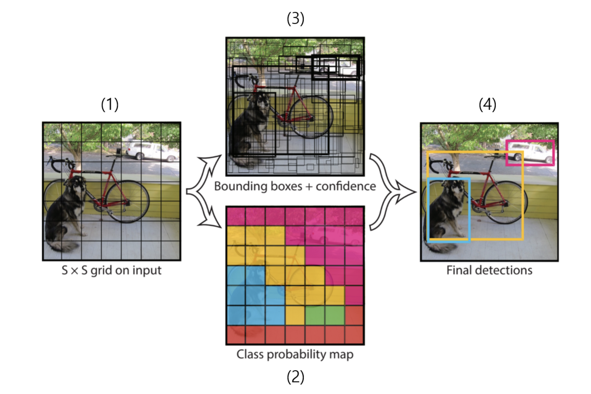
- 시간이 오래 걸리는 Region proposal에서 벗어나 grid별 bounding box(confidence 포함)와 class를 예측하는 방법 적용
- 학습 과정
    1. Image Data를 NxN의 grid로 분할
    2. grid 별로 2개의 bounding box를 예측하여 98개의 class score vector를 추출
    3. 98개의 class score vector를 Non Maximum Suppression(NMS)로 정제
        - Non Maximum Suppression(NMS): 동일 객체에 대해 겹치는 정도(IoU)가 높은 순서대로 정렬 후 Score가 가장 높은 bounding box 기준으로 Threshold를 설정하여 후보군 정의
        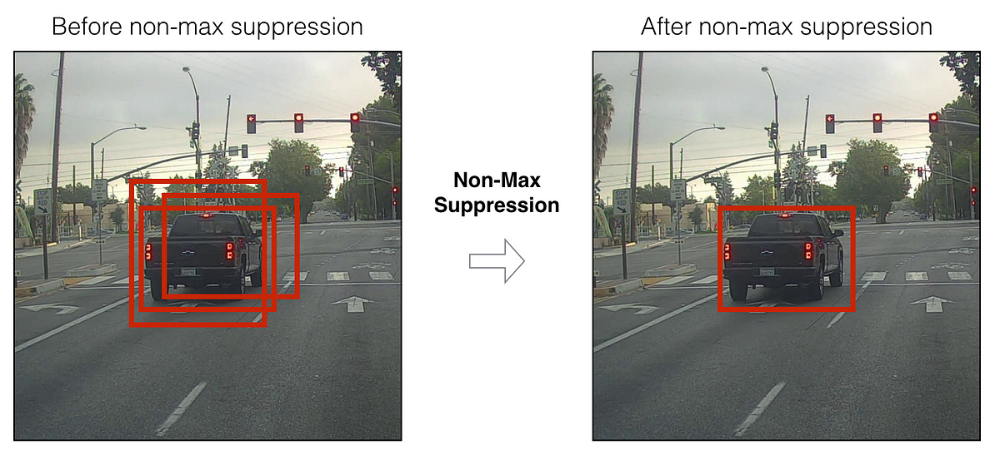
    3. Bounding box와 class에 대한 확률을 통해 객체 인식 및 예측
- 구조
    - 하나의 직선적인 CNN 구조
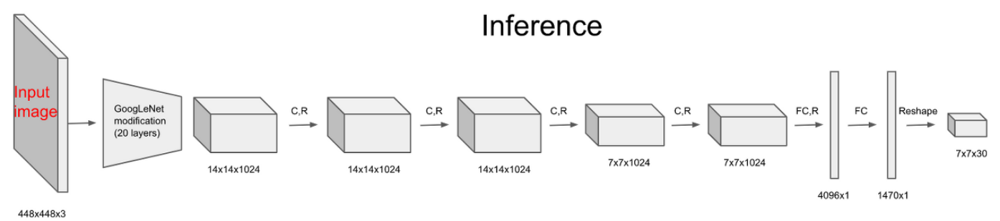
- 단점
    - 가까이 붙어있거나 크기가 작은 Object에 대한 판별이 어려움
    - 부정확한 Bounding box
    - 학습 데이터에 없는 Object에 대한 판별이 어려움
- 버전별 비교‍
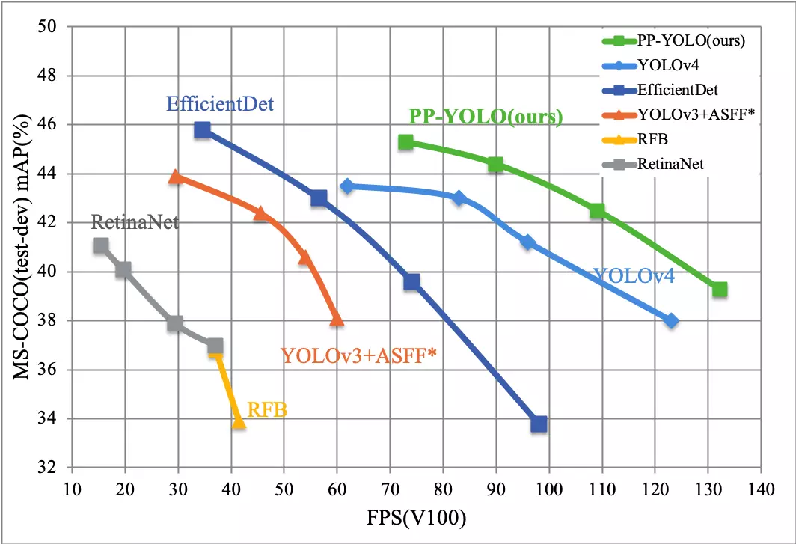
    - YOLO v1 (2016): 실시간 객체 검출을 위한 딥러닝 기반의 네트워크
    - YOLO v2 (2017): v1에서 성능 개선 및 속도 향상
    - YOLO v3 (2018): 네트워크 구조와 학습 방법을 개선하여 Object Detection 정확도와 속도 개선
    - YOLO v4 (2020. 04): SPP와 AN 기술을 적용하여 Object Detection 정확도와 속도 개선
    - YOLO v5 (2020. 06): 전작보다 정확도 10% 이상 향상, 모델 크기 축소
    - YOLO v6 (2022. 07): 훈련 과정의 최적화, Trainable bag-of-freebies 제안
    - YOLO v7 (2022. 09) 알고리즘의 효율성 향상, 시스템 탑재를 위한 Quantization과 Distillation 방식 도입
    - YOLO v8 (2023. 01): 새로운 저장소를 출시하여 객체 감지, 인스턴스 세분화 및 이미지 분류 모델 Train을 위한 통합 프레임 워크로 구축

#### SSD(Single Shot multibox Detector)
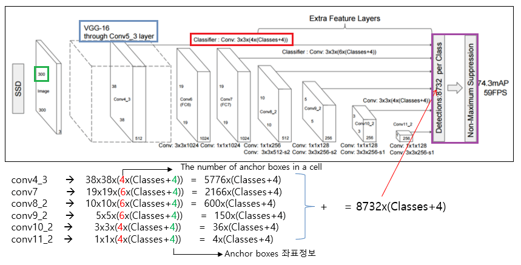
- YOLO의 한계점을 극복하고자 하는 시도에서 출발
- 학습 과정
    1. pretrained VGG-16의 Conv5_3까지를 통해 feature 추출
    2. conv4_3에서 추출한 feature map을 활용하여 미리 설정한 k개의 서로 다른 default box의 위치 예측 및 분류 수행
        - output feature map의 channel 수는 k x (class 수 + 4)가 되도록 설계
    3. 다양한 크기(38X38, 19X19, 10X10, 5X5, 1X1)의 Feature map에서 default box의 위치 예측 및 분류 수행
- 단점
    - 여전히 작은 크기의 object는 찾아내기 어려움
    - 이러한 단점 극복을 위해 Data Augmentation 사용
- 성능 비교
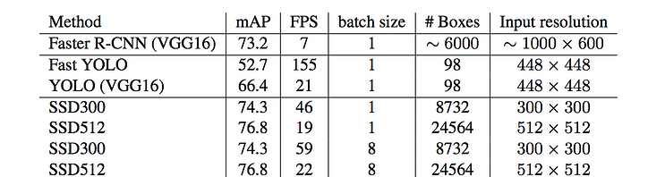

#### FPN(Feature Pyramid Networks)
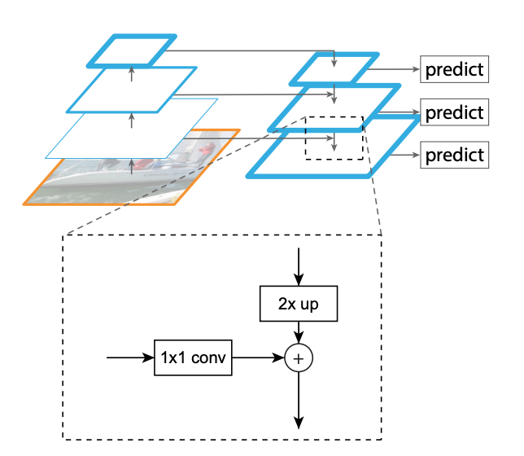
- 기존의 방식과 같이 feature map을 추출하는 forward 과정(=Bottum-Up pathway)과 거꾸로 내려오면서 feature를 합쳐주는 과정(=Top-down pathway)을 통해 object detection을 수행하는 방식
- Top-down 과정에서 feature를 합쳐주는 과정은 up-sampling 과 1x1 skip connection으로 구성
- 성능 비교
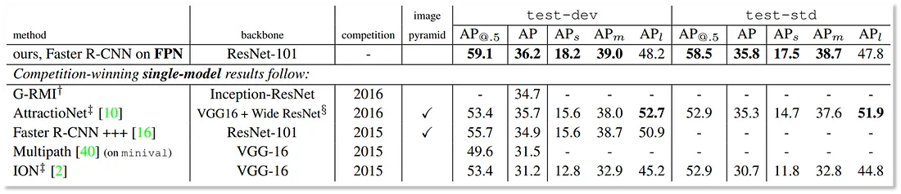