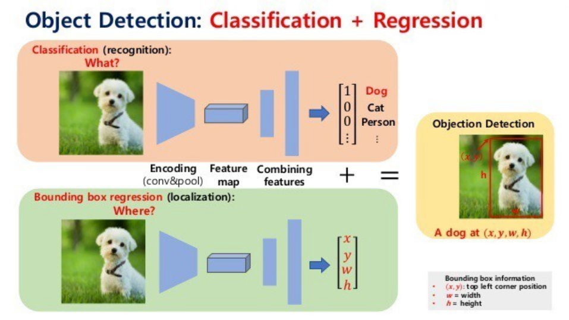
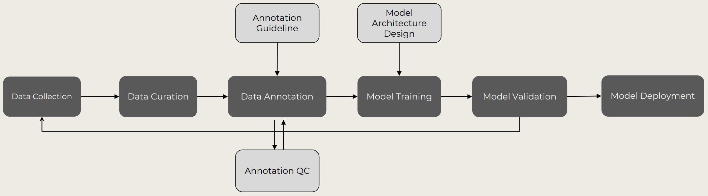
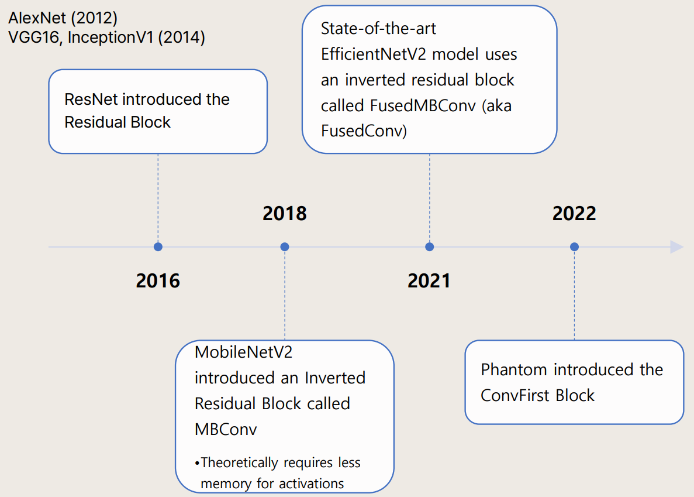
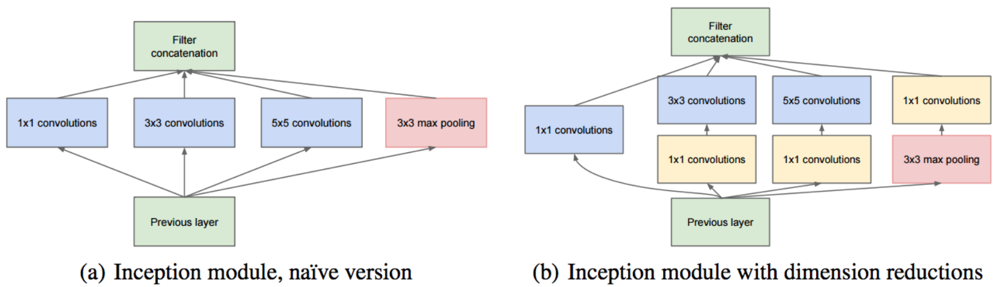
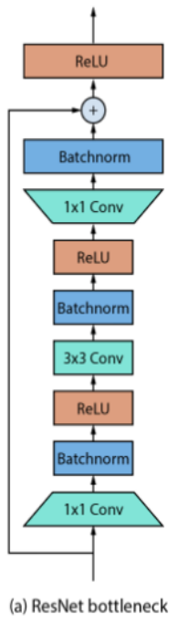
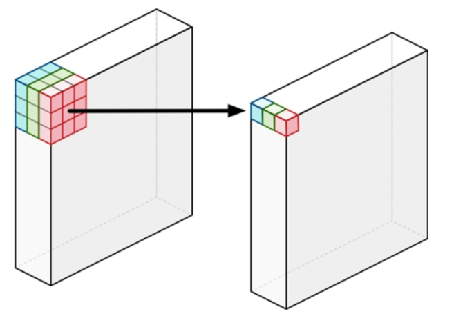
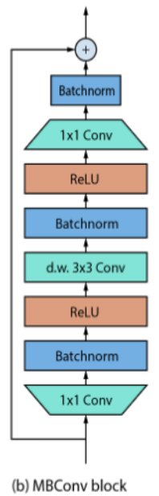

## 자율 주행에 사용되는 DL Models

### 자율 주행에서의 Data Flow

- Gain Control: Deep Learning은 Garbage Input -> Garbage Output 이므로 Best Quality Image 수집이 매우 중요하고 이는 정도가 없으며, 좋은 카메라 사용이 필요

### DL 모델 개발 Process

- Data Curation: 수집한 Data에서 좋은 Data만 추출하는 과정
- Model Training: 어떠한 모델을 학습하고 사용할 것인지 Best 모델을 선택하는 것이 매우 중요

### Vision Model의 흐름
- Application 생성에는 시간 싸움이 중요하므로 자체 모델 생성이 아닌 기존 모델을 customizaiton
- Model 생성 관점: Accuracy(정확도 - Big size 모델 생성 가능) vs Efficient(embeded & real time)
- 자율 주행에서는 한정되어 있는 작은 embeded 칩에서 실시간 처리가 가능 해야하므로 Efficient에 초점  

- Inception Net V1(GoogLeNet): Google에서 2014년 발표한 Conv 레이어를 sparse하게 연결하면서 행렬 연산은 dense하게 처리하는 모델 -> Tesla의 첫 Vision System 기반 모델

    - 그림 (a)
        - Conv 연산은 보통 3차원 데이터에 batch_size를 추가하여 4차원 데이터로 표기 (ex) [B,W,H,C]
        - 1x1 연산은 Conv 연산에 사용하는 필터를 1x1 로 하고 C는 늘리는 것이 아니라 크기를 줄이는 역할
        - C단위로 fully-conntected 연산을 하여 차원을 줄이는 효과 - NIN. (Network in Network)
    - 그림 (b)
        - 그림 (a)의 5x5 연산은 부담이 크므로 계산량을 줄이기 위해 1x1 Conv를 앞에 추가하여 연산 처리
        - 출력 C의 크기를 맞추기 위해 Max Pooling(C 크기 조절 불가) 뒤에 1x1 Conv 추가
- ResNet: Deep Learning의 주요 문제인 Vanishing / Exploding gradients 문제를 해결하기 위해 Residual block를 추가한 모델  

    - Input 값을 그대로 전달하여 더해주는 Shortcut(Skip Connection) 구성
    - Shortcut을 위해서는 Input에 Conv 연산을 적용해 이후 layer와 차원수를 일치 시켜야 함
- MobileNet V2: 모바일 기기에서 동작하는 것을 목표로 효율적 연산을 위해 MBConv를 통해 경량화한 모델
    - 기존 conv 연산과 달리 input feature map의 각 채널에 독립적으로 필터를 적용하여 output feature map을 생성하는 depth wise separable convolution 연산  
  
    - ResNet과 달리 Input에 expansion factor를 곱해 channel을 확장하고 연산 이후에 원래대로 돌려놓는 방식으로 MobileNet V2의 모듈은 Inverted residual block로 지칭함  
  
    
- EfficientNet V2:   

